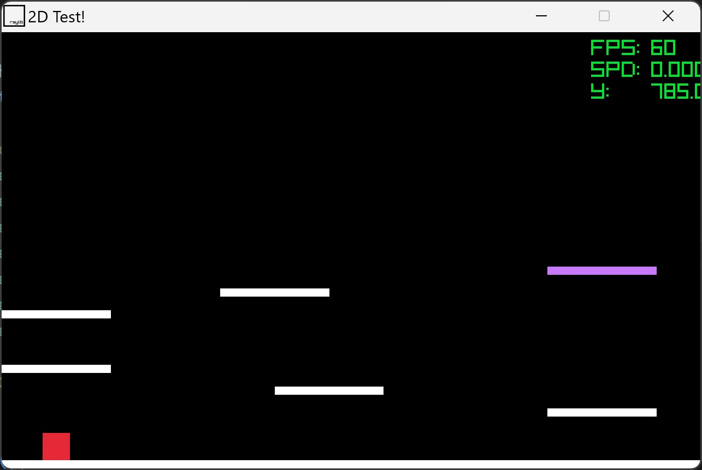

A RayLib project from scratch (a minor pro and a major con)! Dealt with me creating a 2D scene for a few other, smaller projects to be built off of. 

Notes:
- Floor Collision
    - This was the hardest part and the biggest hurdle for me. I didn't realize how much I was carried by the Game Engine functions (ex: Godot's is_on_ground()) until this came around
    - I didn't want/like for my collision to be handled in the main function; I felt like it would lead to very messy code for longer projects and I wanted to avoid that as much as possible
    - Solitions:
        - RayLib functions (CheckCollision...)
            - Issues arose because there was no inherent CheckCollisionRectangleUnkown() function and I didn't want to manaully check for each type of shape/object
        - Partitioning (would still revolve around collisions primarily being handled in main)
            - Issue was that it would still handle collitions in main, though they would be lighter on the computer if properly implemented
        - Raycasting (gross underestimation and misunderstanding of the point of this)
            - Not only did I not understand this term fully, this was outside of the scope of this issue; I just want to know if my player is grounded or not
        - Vector of Objects 
            - Amittedtly, this solution partially came from ChatGPT (which I had been avoiding for this project) with the goal of determing what object was directly under my character; it solution created the game_objects.h file and extended the player class from it; then it used pointers to determine what was the object at that position
            - I changed from pointers to enumerators to help with my own readability
            - TODO: create multiple vectors so the "objects" vector doesn't become bloated with every single object in the game (ex: "ground" vector for all objects that the player can stand on)
    - Walls
        - They'd be nice; I "implemented" the enum  but realized I'd have to code new collision logic and didn't want to deal with it at the moment

Demo: A simple platforming challenge! Try to reach the purple platform

